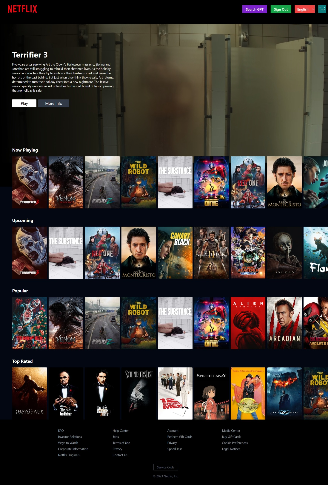
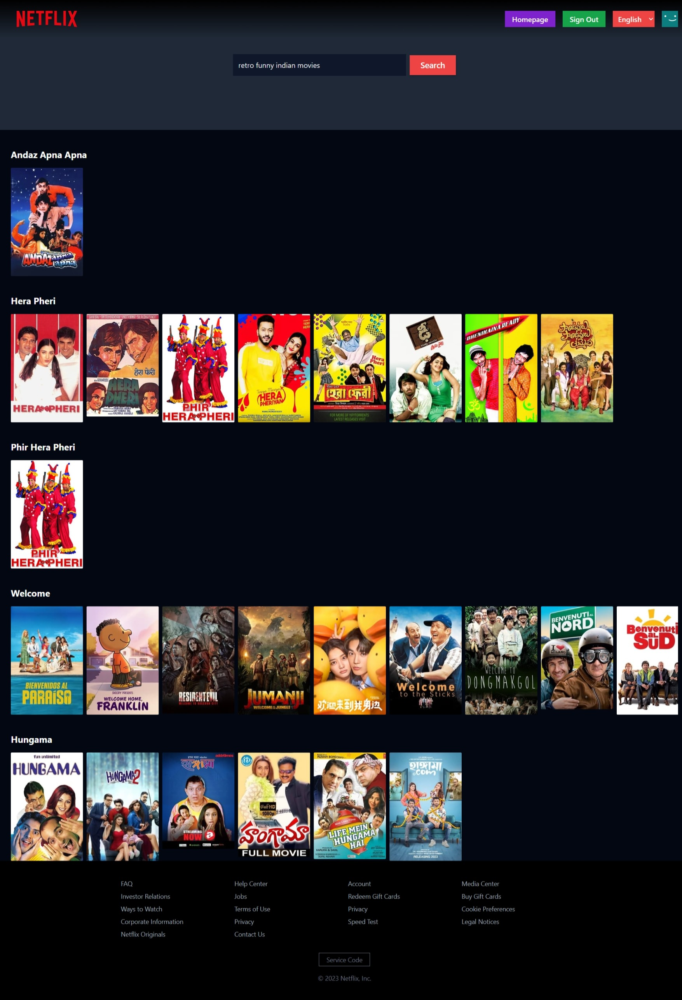

## 🎬 Netflix Clone with GPT-powered Search ✨

Welcome to the world of movies, made even more magical with a touch of AI! 🤖 This project is a recreation of the beloved Netflix platform, built with the power of React and Redux. But wait, there's more! 🤯 We've infused it with an incredible GPT-powered search feature for movie recommendations that will blow your mind. 🤯

### Here's what makes this project shine:

- **✨  Authentication:** 
Sign in or sign up seamlessly with your email and password, and get ready to dive into a world of entertainment. 

- **🏠  Home Page:** A beautiful and inviting home page featuring a captivating featured movie and a scrolling list of recommendations. You'll be hooked from the first glance! 

- **🔍  Browse Page:** Explore a carefully curated selection of movies organized into categories: Now Playing, Upcoming, Popular, and Top Rated. There's something for everyone! 

- **🧠 GPT Search:** 
This is where things get truly exciting! Enter your movie preferences into the search bar powered by Google's Gemini model, and let GPT work its magic. It will suggest personalized recommendations that you'll love. 

- **🎥 Movie Details:**  
Get all the details you need: watch trailers, read synopsis, and discover more about the movies that pique your interest.

- **🖥️ Responsive Design:** 
This app adapts seamlessly to your screen size, whether you're on a desktop, tablet, or mobile device.  Enjoy a smooth and delightful experience wherever you go! 

- **🌎 Multilingual Support:**  
We believe everyone should have access to amazing content. The app is available in multiple languages, ensuring a more inclusive experience for all.

### Tech Stack:

- **Frontend:** React ⚛️, Redux 🧰, react-router-dom 🛣️, firebase 🔥, google-generative-ai 🧠
- **Backend:** Firebase for Authentication 🔥
- **API:** The Movie Database (TMDB) for movie data 🎬

### Ready to Get Started?

1. **Clone the repository:**  `git clone https://github.com/GuptaRav1/netflix-gpt`
2. **Install dependencies:**  `npm install`
3. **Create a `.env` file:**  You'll need to create a `.env` file in the root of your project and add the following environment variables:
   - `VITE_TMDB_KEY`: Your TMDB API key.
   - `VITE_GOOGLE_KEY`: Your Google Generative AI API key.
   - `VITE_FIREBASE_KEY`: Your Firebase configuration (check the Firebase documentation for details).
4. **Start the development server:**  `npm run dev`

### 🚀 Contributions Welcome!

We're always open to new ideas and improvements. Feel free to open an issue or submit a pull request to help make this project even better. 

### What's Next?

- **🌟 User Profile Management:**  Let's personalize the experience further with user profiles.
- **⭐️ Movie Ratings and Reviews:**  Share your thoughts and connect with other movie lovers.
- **🔍 Advanced Search:**  Explore more granular filtering options to find exactly what you're looking for.
- **💰  Payment System:**  Let's make it easy to subscribe and access even more content.
- **🧠  Other AI Models:**  We can explore other generative AI models for even more exciting features.
- **🍿  Watchlist:**  Keep track of your favorites and never miss a movie you want to see.

### Let's make this Netflix clone even more incredible together! 🍿✨